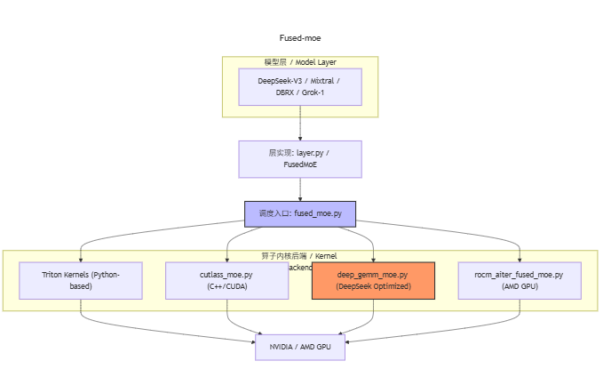
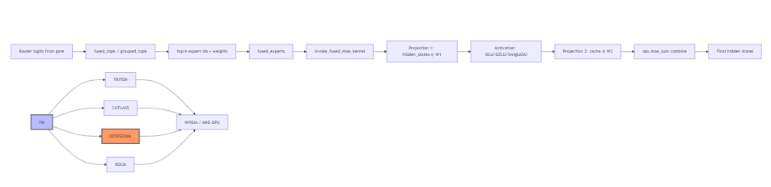

# vLLM Fused MoE: Architecture and Extension Guide

This document explains what `vllm/model_executor/layers/fused_moe/fused_moe.py` does, how it connects to upper and lower layers, and how to extend it (e.g., integrating a custom "Sonic MoE" kernel).

## What This File Does

`fused_moe.py` provides the high-performance, fused forward path for Mixture-of-Experts (MoE) layers used by many models in vLLM. It:

- Implements Top-K expert selection (routing) utilities.
- Dispatches to GPU kernels to run the two-expert-projection pattern (W1 → activation → W2) efficiently for routed tokens.
- Supports multiple backends and quantization schemes (FP8, INT8/INT4, MX formats).
- Exposes simple Python entry points used by model code.

## Upstream and Downstream



```
[Models]  DeepseekV2/Mixtral/DBRX/... (call FusedMoE layer)
    │
    ▼
[layer.py] FusedMoE (high-level orchestration: gating, routing, EP)
    │
    ▼
[fused_moe.py] (this file)
  - fused_topk(), grouped_topk()        # Top-K routing helpers
  - fused_experts() / *fused_experts_impl*  # Fused expert compute
  - invoke_fused_moe_kernel()           # Backend kernel dispatch
  - Triton kernels (@triton.jit)        # GPU kernels for MoE
    │
    ├───────────────┬──────────────────────────┬─────────────────────
    ▼               ▼                          ▼
[deep_gemm_moe.py] [cutlass_moe.py]         [rocm_aiter_fused_moe.py]
(CUDA DeepGEMM)    (CUTLASS)                 (ROCm AITer path)
    └───────────── Lower-level GPU kernels / libraries ──────────────┘
```

- Upstream callers are model implementations via `FusedMoE` in `layer.py`.
- Downstream are concrete kernels (Triton in this file, plus CUTLASS/DeepGEMM/ROCm backends).

## Key Entry Points

- `fused_topk()` and `grouped_topk()`
  - Compute expert selections and routing weights from gating logits.
  - `grouped_topk()` adds group-aware selection for models like DeepSeek.
- `fused_experts()`
  - Public API for fused MoE computation.
  - Chooses DeepGEMM FP8 path when allowed, otherwise dispatches to in-place or out-of-place custom ops backed by `fused_experts_impl()`.
- `invoke_fused_moe_kernel()`
  - Central dispatch to the actual matrix-multiply kernels for the two projections.
  - Chooses among Triton kernels in this file or specialized backends (e.g., WNA16 CUDA path, CUTLASS, DeepGEMM, ROCm).
- Triton kernels: `fused_moe_kernel`, `fused_moe_kernel_gptq_awq`, helper `write_zeros_to_output`.

## Execution Flow (High Level)



1. Gate network produces `router_logits` per token.
2. `fused_topk()` (or `grouped_topk()`) selects top-k experts and routing weights.
3. `fused_experts()` → `fused_experts_impl()` arranges tokens per expert and manages temporary buffers.
4. `invoke_fused_moe_kernel()` runs:
   - First projection: `hidden_states @ W1 → cache1`.
   - Activation: SiLU/GELU/SwigluOAI or no-mul variants.
   - Second projection: `cache2 @ W2 → cache3`.
5. Final combine (weighted sum across experts) writes the output hidden states.

## Backend Selection and Kernels

- Triton kernels (in this file): generic, optimized GPU kernels for MoE.
- WNA16 CUDA path: for INT4/INT8 WNA16 (`use_int4_w4a16`/`use_int8_w8a16`) with block-wise quant. Uses CUDA kernels via `_custom_ops` when heuristics favor it (see `should_moe_wna16_use_cuda`).
- DeepGEMM FP8 (in `deep_gemm_moe.py`): can be selected by `fused_experts(allow_deep_gemm=True, quant_config.use_fp8_w8a8=True)`.
- CUTLASS FP8/FP4 (in `cutlass_moe.py`): alternative backend when appropriate.
- ROCm AITer: `rocm_aiter_fused_moe.py` for ROCm-optimized paths.

The dispatcher tunes tile/block sizes dynamically using `try_get_optimal_moe_config()` and per-device config files `configs/*.json`.

## Quantization Support

- Activations and weights may be FP8/INT8/INT4 or MX formats.
- `fused_moe.py` supports per-token/per-block quant; dequant emulation for some MX formats when native kernels are unavailable.
- Helper `_get_config_quant_dtype()` and `moe_kernel_quantize_input()` manage activation quantization before kernel calls.

## Batch Invariance and Configs

- Batch-invariant mode enforces deterministic expert selection (e.g., `sorted=True` in top-k).
- Config tuning can be loaded from pre-tuned JSON files, selected by `get_moe_configs()` with keys `(E, N, device, dtype, block_shape)`.

## Environment and Flags (selected)

- `VLLM_USE_FUSED_MOE_GROUPED_TOPK`: enable fused grouped top-k path (CUDA).
- `VLLM_TUNED_CONFIG_FOLDER`: point to user-provided tuned configs for MoE.
- `VLLM_FUSED_MOE_CHUNK_SIZE`: chunk size for processing large batches.

## Extension: Adding a New Kernel (e.g., "Sonic MoE")

To integrate a custom kernel, you generally hook in at the dispatch layer and (optionally) register a new custom op.

1. Implement the kernel
   - Triton: add a new `@triton.jit` kernel in a new file (e.g., `sonic_moe.py`) under `vllm/model_executor/layers/fused_moe/`.
   - CUDA/C++: expose a binding in `_custom_ops` (e.g., `ops.sonic_moe(...)`) following existing patterns (`ops.moe_wna16_gemm`, `ops.moe_sum`, etc.).
2. Dispatch from Python
   - Modify `invoke_fused_moe_kernel()` (or add a sibling helper) to choose your kernel based on flags/configs (e.g., env var `VLLM_USE_SONIC_MOE=1`, dtype, block sizes, device).
   - Ensure it covers both projections (W1 and W2) with the same token/expert mapping.
3. Quantization and layout
   - Respect current quant/packing paths (`use_fp8_w8a8`, `use_int8_w8a8`, `use_int4_w4a16`, `block_shape`).
   - Accept the same tensor layouts and strides used by existing backends; or add focused conversions.
4. Combine step
   - Reuse `ops.moe_sum` to combine expert contributions or implement an equivalent in-kernel combine if fully fused.
5. Optional: Modular path
   - Implement a `mk.FusedMoEPermuteExpertsUnpermute` subclass (see `TritonExperts`) to plug into the modular kernel flow when using `modular_triton_fused_moe()`.

### Minimal Dispatch Sketch

```python
# inside invoke_fused_moe_kernel(...)
if envs.get_bool("VLLM_USE_SONIC_MOE", False):
    # validate shapes/quant, then call your op
    ops.sonic_moe(
        A, C, B, B_scale, B_zp, topk_weights,
        sorted_token_ids, expert_ids, num_tokens_post_padded,
        top_k, block_m, block_n, block_k,
        # plus any extra Sonic-specific args
    )
    return
# else fall back to existing paths
```

## Where to Look in the Code

- Entry points you will likely touch:
  - `vllm/model_executor/layers/fused_moe/fused_moe.py`
    - `fused_experts()` / `fused_experts_impl()`
    - `invoke_fused_moe_kernel()`
    - Triton kernels: `fused_moe_kernel*`
  - `vllm/model_executor/layers/fused_moe/layer.py`
    - `FusedMoE` orchestration and how models call into fused MoE
  - Alternative backends for reference:
    - `deep_gemm_moe.py`, `cutlass_moe.py`, `rocm_aiter_fused_moe.py`

## Testing Tips

- Start with a single batch, small `hidden_size`, and `top_k=1`.
- Compare outputs against the unfused PyTorch reference (e.g., disable fused path temporarily) to validate correctness.
- Validate multiple dtypes/quant settings if your kernel supports them.

---

If you want, I can add a guarded dispatch stub for a `VLLM_USE_SONIC_MOE` flag and wire in a placeholder call to `ops.sonic_moe(...)` for you.
